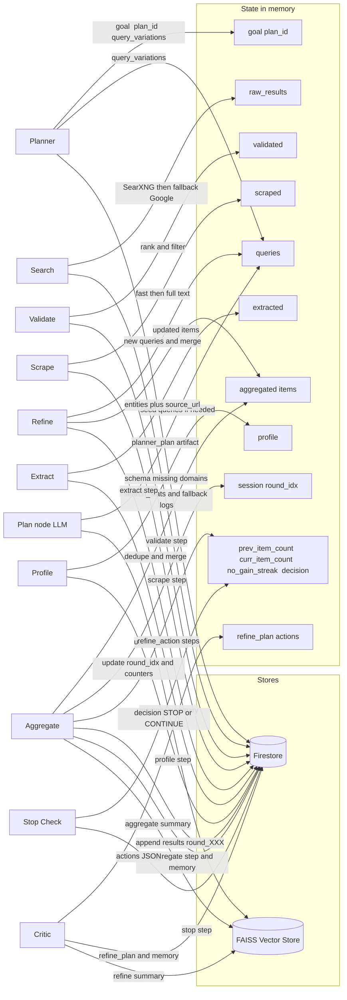

```mermaid
flowchart LR
subgraph Stores
  FS[(Firestore)]
  VS[(FAISS Vector Store)]
end

subgraph State in memory
  direction TB
  S0[goal  plan_id]
  S1[queries]
  S2[raw_results]
  S3[validated]
  S4[scraped]
  S5[extracted]
  S6[aggregated items]
  S7[profile]
  S8[refine_plan actions]
  S9[session round_idx]
  SX[prev_item_count  curr_item_count  no_gain_streak  decision]
end

A1[Planner] -->|goal  plan_id  query_variations| S0
A1 -->|query_variations| S1
A1 -->|planner_plan artifact| FS

A2[Plan node LLM] -->|seed queries if needed| S1
A2 -->|memory summary| VS

A3[Search] -->|SearXNG then fallback Google| S2
A3 -->|search_stats and fallback logs| FS

A4[Validate] -->|rank and filter| S3
A4 -->|validate step| FS

A5[Scrape] -->|fast then full text| S4
A5 -->|scrape step| FS

A6[Extract] -->|entities plus source_url| S5
A6 -->|extract step| FS

A7[Aggregate] -->|dedupe and merge| S6
A7 -->|update round_idx and counters| S9
A7 -->|update counters| SX
A7 -->|append results round_XXX| FS
A7 -->|aggregate step and memory| FS
A7 -->|aggregate summary| VS

A8[Profile] -->|schema missing domains| S7
A8 -->|profile step| FS

A9[Critic] -->|actions JSON| S8
A9 -->|refine_plan and memory| FS
A9 -->|refine summary| VS

A10[Refine] -->|new queries and merge| S1
A10 -->|updated items| S6
A10 -->|refine_action steps| FS

A11[Stop Check] -->|decision STOP or CONTINUE| SX
A11 -->|stop step| FS

```