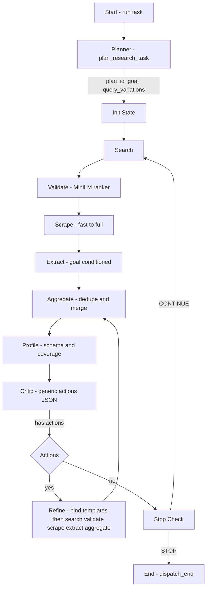

```mermaid
    flowchart TD
        A[Start - run task] --> B[Planner - plan_research_task]
        B -->|plan_id  goal  query_variations| C[Init State]
        C --> D[Search]
        D --> E[Validate - MiniLM ranker]
        E --> F[Scrape - fast to full]
        F --> G[Extract - goal conditioned]
        G --> H[Aggregate - dedupe and merge]
        H --> I[Profile - schema and coverage]
        I --> J[Critic - generic actions JSON]
        J -->|has actions| K{Actions}
        K -- yes --> L[Refine - bind templates then search validate scrape extract aggregate]
        L --> H
        K -- no --> S[Stop Check]
        S -- CONTINUE --> D
        S -- STOP --> T[End - dispatch_end]
```