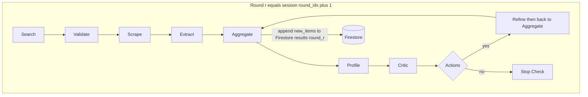

```mermaid
flowchart TD
subgraph Round r equals session round_idx plus 1
  D[Search] --> E[Validate] --> F[Scrape] --> G[Extract] --> H[Aggregate]
  H --> I[Profile] --> J[Critic] --> K{Actions}
  K -- yes --> L[Refine then back to Aggregate]
  L --> H
  K -- no --> S[Stop Check]
  H -->|append new_items to Firestore results round_r| X[(Firestore)]
end
```