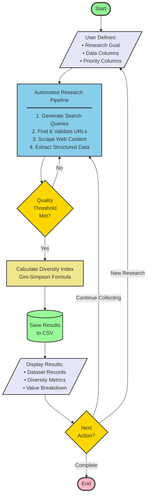

# Automated Research System - High-Level Flowchart

## System Overview (Presentation)

## Key Components

### 🎯 User Input
- Define research goal and objectives
- Specify data columns to extract
- Mark priority columns for diversity tracking

### 🤖 Automated Research Pipeline
**4-Step Process:**
1. **Query Generation** - AI creates optimized search queries
2. **URL Discovery** - Finds and validates relevant web sources
3. **Content Scraping** - Extracts HTML from validated URLs
4. **Data Extraction** - Uses LLM to parse structured information

### 📊 Quality & Diversity Analysis
- **Quality Check** - Ensures threshold requirements are met
- **Diversity Index** - Gini-Simpson formula: `1 - Σ(n_i/N)²`
- **Value Breakdown** - Shows distribution across priority columns

### 💾 Results & Output
- Saves dataset to CSV format
- Displays diversity metrics and statistics
- Interactive loop for continued research

## Example Use Case

**Research Goal:** "Find hospitals in Toronto"

**User Input:**
- Columns: Name, Address, City, Website
- Priority Column: City (for diversity tracking)

**System Output:**
- 15 hospital records extracted
- Diversity Index: 0.42 (cities include Toronto, Vaughan, Mississauga)
- CSV file with complete dataset
- Visual breakdown of city distribution

---

## Technical Stack

- **Frontend:** HTML5, JavaScript, Socket.IO
- **Backend:** Python, Flask, LangGraph
- **AI/LLM:** OpenAI GPT-4o-mini
- **Search:** SearXNG API
- **Database:** PostgreSQL + CSV Export
